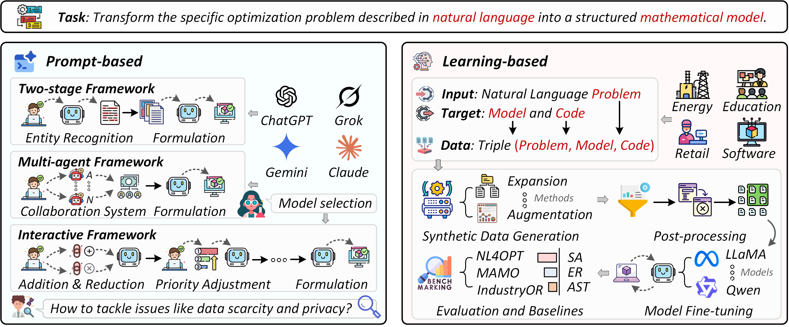
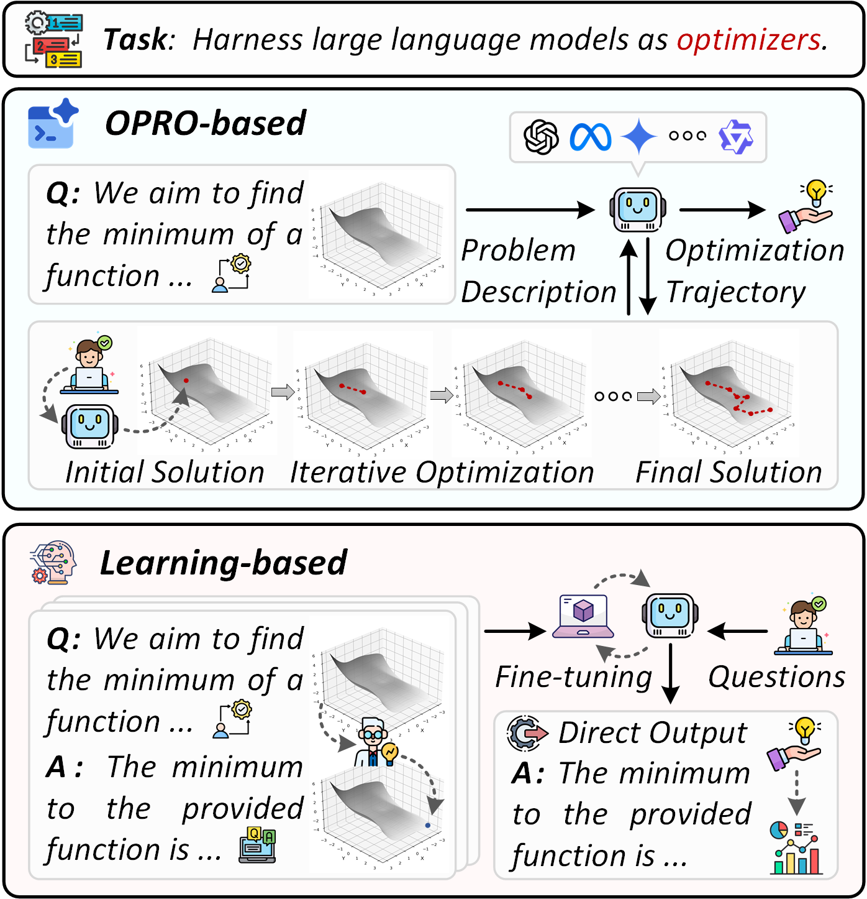
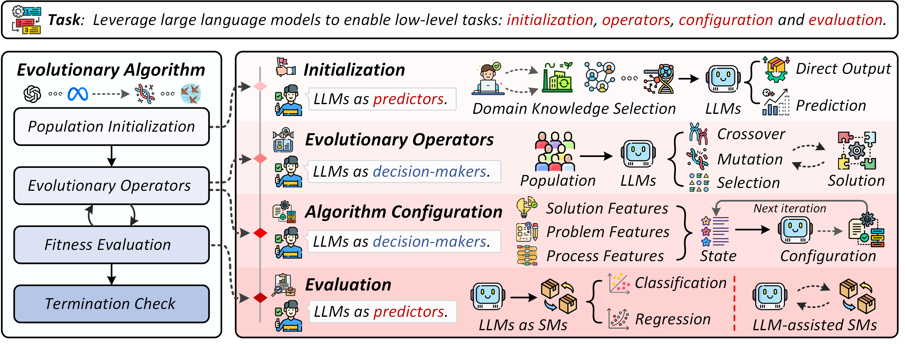
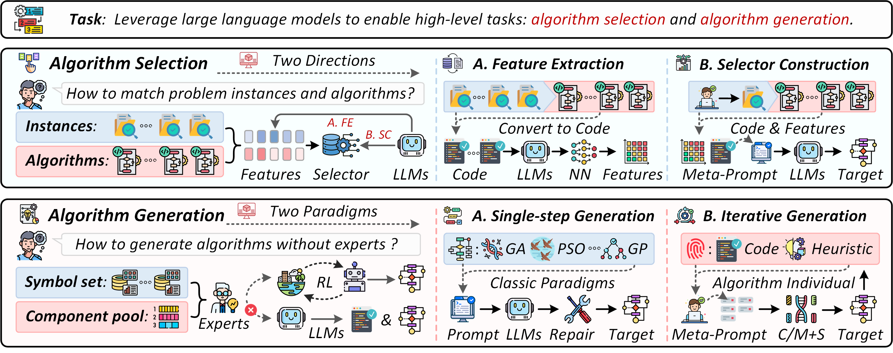

# LLM4OPT: from Modeling to Solving

This is a collection in the field of LLM for optimization, **covering LLM service optimization modeling and optimization solving**. For detailed classification methods and introductions, please refer to the article: [A Systematic Survey on Large Language Models for Evolutionary Optimization: From Modeling to Solving](https://arxiv.org/abs/2509.08269).

## 🎯 LLMs for Optimization

Optimization techniques have become a core tool for solving complex problems across diverse fields such as engineering design, economic planning, and scientific discovery. When tackling real-world challenges, researchers typically abstract them into mathematical optimization models, which are then solved using various optimization algorithms. In recent years, large language models (LLMs) have emerged as a powerful paradigm, offering novel perspectives and capabilities for the field of optimization. The application of LLMs in optimization spans two primary areas: **modeling** and **solving**.

We provide a **classification** and **collection** of these applications to serve as a reference for researchers. We propose a new taxonomy to clearly articulate the deep relationship between LLMs and the optimization process. Specifically, we classify the research in this field into two main categories: LLMs for optimization modeling and LLMs for optimization solving. The latter, LLMs for optimization solving, is further subdivided into three classes: LLMs as optimizers, low-level LLMs assisted optimization algorithms, and high-level LLMs assisted optimization algorithms. The specific definitions for these are as follows:

1. 💻 **LLMs for Optimization Modeling** aims to automatically transform unstructured natural language descriptions of problems into mathematical optimization models that can be understood and solved by machines. This research area is the foundational step toward achieving a fully LLM-driven optimization workflow, with the core challenge lying in bridging the gap between ambiguous natural language and precise mathematical models. Two main paradigms exist in this field: prompt-based and learning-based methods. The former typically relies on carefully designed prompting procedures or the collaboration of multiple agents, with the advantage of being quickly deployable without additional training. The latter, however, often requires data synthesis and model fine-tuning. While these methods incur training costs, they can significantly enhance modeling reliability in complex scenarios.

2. 🤖 **LLMs as Optimizers** refers to the use of LLMs directly as general-purpose optimizers, which solve optimization problems through iterative natural language interaction without relying on traditional optimization algorithm frameworks. This paradigm leverages the powerful in-context learning and complex reasoning capabilities of LLMs to analyze optimization trajectories and continuously generate more promising candidate solutions. Although this direct optimization approach faces challenges such as model dependency, it stands as the earliest bridge connecting large models to optimization tasks, possessing significant pioneering importance and potential.

3. 🔧 **Low-level LLMs for Optimization Algorithms** refers to the paradigm of embedding LLMs as intelligent components within traditional optimization algorithms to enhance their specific operations. Unlike acting as a standalone optimizer, this approach tightly integrates LLMs with traditional evolutionary algorithms, leveraging the models' powerful data analysis capabilities and rich domain knowledge to boost algorithmic performance. Specifically, LLMs can be applied to core processes such as algorithm initialization, evolutionary operators, algorithm configuration, and fitness evaluation. This method relies on an efficient optimization framework to empower traditional components, enabling them to adapt more intelligently to different problem characteristics and search states, thereby improving the algorithm's efficiency and solution quality at a fundamental level.

4. 🎨 **High-level LLMs for Optimization Algorithms** differs from the low-level assistance paradigm by focusing on the top-level orchestration or design of algorithms, rather than their internal components. Specifically, high-level assistance involves two types of tasks: algorithm selection and algorithm generation. The algorithm selection task aims to match the most suitable algorithm from a pool for different problem instances, whereas algorithm generation goes a step further, requiring LLMs to autonomously design new algorithms to better fit a given problem. This class of methods grants LLMs a global perspective over the entire optimization task, transforming their role from an internal assistant to a top-level designer for the entire optimization workflow.

## 🤝 How to Contribute

We welcome any suggestions and pull requests! This list is far from comprehensive, and we encourage the community to help us improve it.

### 📋 Ways to Contribute

1. 🛠️ **Fork, Add, and Merge** 
   - Fork this repository
   - Add your suggestions or updates
   - Submit a pull request for review

2. 🐛 **Report Issues** 
   - Found a problem or have a suggestion?
   - Open an issue to let us know

3. 📧 **Direct Contact** 
   - Have questions or want to collaborate?
   - Contact Yisong Zhang at [23s004040@stu.hit.edu.cn](mailto:23s004040@stu.hit.edu.cn)

### 📜 Sharing Principle

The references listed here are shared for **research purposes only**. If you are an author and do not wish your work to be listed here, please feel free to contact us. We will promptly remove the content upon request.

---

⭐ **We appreciate your contributions to making this resource better for everyone!**

## 📑 Table of Contents

- 📚 [1. Survey Papers](#1-survey-papers)
- 💻 [2. LLMs for Optimization Modeling](#2-LLMs-for-Optimization-Modeling)
  - 🎮 [2.1 Prompt-based Methods](#21-Prompt-based-Methods)
  - 🧠 [2.2 Learning-based Methods](#22-Learning-based-Methods)
- ⚙️ [3. LLMs for Optimization Solving](#3-LLMs-for-Optimization-Solving)
  - 🤖 [3.1 LLMs as Optimizers](#31-LLMs-as-Optimizers)
  - 🔧 [3.2 Low-level LLMs for Optimization Algorithms](#32-Low-level-LLMs-for-Optimization-Algorithms)
  - 🎨 [3.3 High-level LLMs for Optimization Algorithms](#33-High-level-LLMs-for-Optimization-Algorithms)

## 1. Survey Papers
| **Title** | **Publication** | **Year** |
|-----------|--------------|------|
| [Evolutionary Computation in the Era of Large Language Model: Survey and Roadmap](https://arxiv.org/abs/2401.10034) | TEVC | 2024 |
| [When Large Language Model Meets Optimization](https://arxiv.org/abs/2405.10098) | SWEVO | 2024 |
| [When Large Language Models Meet Evolutionary Algorithms](https://arxiv.org/abs/2401.10510) | Research | 2024 |
| [Exploring the Improvement of Evolutionary Computation via Large Language Models](https://arxiv.org/abs/2405.02876) | GECCO | 2024 |
| [A Systematic Survey on Large Language Models for Algorithm Design](https://arxiv.org/abs/2410.14716) | arXiv | 2024 |
| [Deep Insights into Automated Optimization with Large Language Models and Evolutionary Algorithms](https://arxiv.org/abs/2410.20848) | arXiv | 2024 |
| [Toward Automated Algorithm Design: A Survey and Practical Guide to Meta-Black-Box-Optimization](https://arxiv.org/abs/2411.00625) | TEVC | 2024 |
| [Evolutionary Computation and Large Language Models: A Survey of Methods, Synergies, and Applications](https://arxiv.org/abs/2505.15741) | arXiv | 2025|
| [A Survey of Optimization Modeling Meets LLMs: Progress and Future Directions](https://arxiv.org/abs/2508.10047) | arXiv | 2025 |

## 2. LLMs for Optimization Modeling
We'll delve into two core paradigms for using LLMs for optmization modeling: prompt-based methods and learning-based methods. Prompt-based methods leverage carefully designed instructions to guide the LLM in completing modeling tasks. This often involves a two-stage workflow or the collaboration of multiple LLMs. Learning-based methods, on the other hand, use fine-tuned models to directly generate mathematical models. However, they typically require pre-training on a large amount of synthetic data.

    

### 2.1 Prompt-based Methods

| **Title** | **Publication** | **Year** | **Type** | **Summary** |
|-----------|--------------|------|------|----------|
| [NER4OPT: Named Entity Recognition for Optimization Modelling from Natural Language](https://link.springer.com/chapter/10.1007/978-3-031-33271-5_20) | CPAIOR | 2023 | Two-stage | Fine-tune models for named entity recognition by incorporating traditional NLP methods. |
| [Towards an Automatic Optimisation Model Generator Assisted with Generative Pre-trained Transformer](https://arxiv.org/abs/2305.05811) | GECCO | 2023 | Direct | Directly leverage LLMs to generate mathematical models. |
| [Holy Grail 2.0: From Natural Language to Constraint Models](https://arxiv.org/abs/2308.01589) | arXiv | 2023 |Two-stage | Embed LLMs within the two-stage framework. |
| [Synthesizing mixed-integer linear programming models from natural language descriptions](https://arxiv.org/abs/2311.15271) | arXiv | 2023 | Two-stage | Employ fine-tuned models for constraint classification. |
| [Chain-of-experts: When llms meet complex operations research problems](https://openreview.net/pdf?id=HobyL1B9CZ) | ICLR | 2023 | Multi-agent | Construct dynamic reasoning chains using 11 expert agents. |
| [OptiMUS: Scalable Optimization Modeling with (MI)LP Solvers and Large Language Models](https://arxiv.org/abs/2402.10172) | ICML | 2023 | Multi-agent | Develop a conductor agent to coordinate modeling, programming, and evaluation processes. |
| [Optimization modeling and verification from problem specifications using a multi-agent multi-stage LLM framework](https://www.tandfonline.com/doi/abs/10.1080/03155986.2024.2381306) | INFOR | 2024 | Multi-agent | Develop inter-agent cross-validation to replace solver-dependent verification. |
| [Democratizing energy management with llm-assisted optimization autoformalism](https://ieeexplore.ieee.org/abstract/document/10738100) | SGC | 2024 | Two-stage | Apply the two-stage framework to energy management systems. |
| [CAFA: Coding as Auto-Formulation Can Boost Large Language Models in Solving Linear Programming Problem](https://openreview.net/pdf?id=xC2xtBLmri) | NeurIPS | 2024 | Two-stage | Enhance modeling performance through code-based formalization. |
| [Llms for mathematical modeling: Towards bridging the gap between natural and mathematical languages](https://arxiv.org/abs/2405.13144) | NAACL | 2024 | Two-stage | Develop the MAMO benchmark with ordinary differential equation extensions. |
| [Abstract Operations Research Modeling Using Natural Language Inputs](https://www.mdpi.com/2078-2489/16/2/128) | arXiv | 2024 | Two-stage | Predefine abstract structural constraints to regulate the LLM outputs. |
| [TRIP-PAL: Travel Planning with Guarantees by Combining Large Language Models and Automated Planners](https://arxiv.org/abs/2406.10196) | arXiv | 2024 | Two-stage | Apply the two-stage framework to travel planning. |
| [Solving General Natural-Language-Description Optimization Problems with Large Language Models](https://arxiv.org/abs/2407.07924) | arXiv | 2024 | Interactive | Support both single-input and interactive-input modes. |
| [OptiMUS-0.3: Using Large Language Models to Model and Solve Optimization Problems at Scale](https://arxiv.org/abs/2407.19633) | arXiv | 2024 | Multi-agent | Introduce self-corrective prompts and structure-aware modeling based on OptiMUS. |
| [“I Want It That Way”: Enabling Interactive Decision Support Using Large Language Models and Constraint Programming](https://dl.acm.org/doi/abs/10.1145/3685053) | TiiS | 2024 | Interactive | Develop an interactive system for user input processing with five selectable task options. |
| [Values in the Loop: Designing Interactive Optimization with Conversational Feedback](https://dl.acm.org/doi/abs/10.1145/3719160.3735655) | CUI | 2025 | Interactive | Convert user priorities into optimization constraints during dialog interactions. |
| [Autoformulation of Mathematical Optimization Models Using LLMs](https://arxiv.org/abs/2411.01679) | arXiv | 2025 | Two-stage | Conduct hierarchical Monte Carlo tree search over the hypothesis space. |
| [EquivaMap: Leveraging LLMs for Automatic Equivalence Checking of Optimization Formulations](https://arxiv.org/abs/2502.14760) | arXiv | 2025 | Two-stage | Generate variable mapping functions via LLMs with lightweight verification. |
| [Large Language Model-Based Automatic Formulation for Stochastic Optimization Models](https://arxiv.org/abs/2508.17200) | arXiv | 2025 | Multi-agent | Deploy multiple independent reviewers to evaluate modeling results. |
| [ORMind: A Cognitive-Inspired End-to-End Reasoning Framework for Operations Research](https://arxiv.org/abs/2506.01326) | arXiv | 2025 | Multi-agent | Replace the conductor agent with structured, predictable workflows. |

### 2.2 learning-based Methods

| **Title** | **Publication** | **Year** | **Type** | **Summary** |
|-----------|--------------|------|------|----------|
| [LM4OPT: Unveiling the Potential of Large Language Models in Formulating Mathematical Optimization Problems](https://arxiv.org/abs/2403.01342) | INFOR | 2024 | Fine-tuning | Progressively fine-tune models on the NL4OPT dataset. |
| [ORLM: A Customizable Framework in Training Large Models for Automated Optimization Modeling](https://pubsonline.informs.org/doi/abs/10.1287/opre.2024.1233) | OR | 2024 | Data synthesis | Synthesize data through expansion and augmentation and fine-tune open-source models. |
| [OptiBench Meets ReSocratic: Measure and Improve LLMs for Optimization Modeling](https://arxiv.org/abs/2407.09887) | ICLR | 2024 | Data synthesis | Propose inverse data synthesis methodology and construct the OPTIBENCH benchmark. |
| [LLMOPT: Learning to Define and Solve General Optimization Problems from Scratch](https://arxiv.org/abs/2410.13213) | ICLR | 2024 | Fine-tuning | Introduce model alignment and self-correction mechanisms to mitigate hallucination phenomena. |
| [BPP-Search: Enhancing Tree of Thought Reasoning for Mathematical Modeling Problem Solving](https://arxiv.org/abs/2411.17404) | arXiv | 2024 | Data synthesis | Solve the problem of missing detailed in data synthesis. |
| [OptMATH: A Scalable Bidirectional Data Synthesis Framework for Optimization Modeling](https://arxiv.org/abs/2502.11102) | arXiv | 2025 | Data synthesis | Develop a scalable bidirectional data synthesis approach. |
| [Language Models for Business Optimisation with a Real World Case Study in Production Schedulingr](https://arxiv.org/abs/2309.13218) | arXiv | 2025 | Data synthesis | Propose a method for fine-tuning cost-effective LLMs to tackle specific business challenges. |
| [Solver-Informed RL: Grounding Large Language Models for Authentic Optimization Modeling](https://arxiv.org/abs/2505.11792) | arXiv | 2025 | Fine-tuning | Integrate external optimization solvers as verifiable reward validators for reinforcement learning. |
| [Step-Opt: Boosting Optimization Modeling in LLMs through Iterative Data Synthesis and Structured Validation](https://arxiv.org/abs/2506.17637) | arXiv | 2025 | Data synthesis | Increase problem complexity through an iterative problem generation approach. |
| [Auto-Formulating Dynamic Programming Problems with Large Language Models](https://arxiv.org/abs/2507.11737) | arXiv | 2025 | Data synthesis | Combine the diversity of forward generation and the reliability of inverse generation. |
| [Toward a Trustworthy Optimization Modeling Agent via Verifiable Synthetic Data Generation](https://arxiv.org/abs/2508.03117) | arXiv | 2025 | Data synthesis | Develop a verifiable synthetic data generation pipeline. |

## 3. LLMs for Optimization Solving

The advent of large language models has propelled this research into a new phase. This section will delve into three core paradigms for utilizing LLMs in optimization solving: LLMs as optimizers, low-level LLMs for optimization algorithms, and high-level LLMs for optimization algorithms.

### 3.1 LLMs as Optimizers

LLMs as optimizers refers to the use of LLMs directly as general-purpose optimizers, which solve optimization problems through iterative natural language interaction without relying on traditional optimization algorithm frameworks. This paradigm leverages the powerful in-context learning and complex reasoning capabilities of LLMs to analyze optimization trajectories and continuously generate more promising candidate solutions.

    

| **Title** | **Publication** | **Year** | **Type** | **Summary** |
|-----------|--------------|------|------|----------|
| [Large Language Models as Optimizers](https://doi.org/10.48550/arXiv.2309.03409) | ICLR | 2023 | Prompt-based | Iteratively refine through optimization trajectories and problem descriptions. |
| [Towards Optimizing with Large Language Models](https://arxiv.org/abs/2310.05204) | KDD | 2023 | Prompt-based | Design four canonical tasks to evaluate the performance boundaries of LLMs. |
| [Large Language Models As Evolution Strategies](https://dl.acm.org/doi/abs/10.1145/3638530.3654238) | GECCO | 2024 | Prompt-based | Replace traditional optimization trajectories with candidate solution quality ranking. |
| [How Multimodal Integration Boost the Performance of LLM for Optimization: Case Study on Capacitated Vehicle Routing Problems](https://doi.org/10.48550/arXiv.2403.01757) | MCII | 2024 | Prompt-based | Utilize MLLMs to jointly process problem descriptions and map visualizations for CVRPs. |
| [Pretrained Optimization Model for Zero-Shot Black Box Optimization](https://proceedings.neurips.cc/paper_files/paper/2024/file/19e9a88d91917775b34fdad447ed8908-Paper-Conference.pdf) | NeurIPS | 2024 | Learning-based | Pre-train a general-purpose, zero-shot black-box optimization foundation model. |
| [Trace is the Next AutoDiff: Generative Optimization with Rich Feedback, Execution Traces, and LLMs](https://arxiv.org/pdf/2406.16218) | ArXiv | 2024 | Prompt-based | Replace traditional optimization trajectories with rich, structured execution traces. |
| [Visual Reasoning and Multi-Agent Approach in Multimodal Large Language Models (MLLMs): Solving TSP and mTSP Combinatorial Challenges](https://arxiv.org/abs/2407.00092) | ArXiv | 2024 | Prompt-based | Utilize MLLMs to process 2D planar point distribution maps as input |
| [Revisiting OPRO: The Limitations of Small-Scale LLMs as Optimizers](https://arxiv.org/abs/2405.10276) | ACL | 2024 | Prompt-based | Discuss the model dependency of OPRO and identify its limitations on small-scale models. |
| [Exploring the True Potential: Evaluating the Black-box Optimization Capability of Large Language Models](https://arxiv.org/abs/2404.06290) | ArXiv | 2024 | Prompt-based | Conduct evaluation of LLMs on both discrete and continuous black-box optimization problems. |
| [LLMs can Schedule](https://arxiv.org/abs/2408.06993) | ArXiv | 2024 | Learning-based | Fine-tune LLMs with instruction-solution pairs for scheduling problems.|
| [An Optimizable Suffix Is Worth A Thousand Templates: Efficient Black-box Jailbreaking without Affirmative Phrases via LLM as Optimizer](https://arxiv.org/abs/2408.11313) |  NAACL | 2025 | Prompt-based | Apply iterative optimization to jailbreaking attack strategies. |
| [Generalists vs. Specialists: Evaluating LLMs on Highly-Constrained Biophysical Sequence Optimization Tasks](https://arxiv.org/abs/2410.22296) |  ArXiv | Apr 2025 | Learning-based | Integrate preference learning to train LLMs for satisfying complex biophysical constraints. |
| [Large Language Models for Combinatorial Optimization of Design Structure Matrix](https://arxiv.org/abs/2411.12571) | ArXiv | Nov 2024 | Prompt-based | Apply iterative optimization to design structure matrix sequencing. |
| [Large Language Model-Based Wireless Network Design](https://doi.org/10.1109/LWC.2024.3462556) | WCL | Sep 2024 | Prompt-based | Apply iterative optimization to wireless network design. |
| [Bridging Visualization and Optimization: Multimodal Large Language Models on Graph-Structured Combinatorial Optimization](https://arxiv.org/abs/2501.11968) |  ArXiv | 2025  | Prompt-based | Process visual representations of abstract graph structures using MLLMs. |
| [ORFS-agent: Tool-Using Agents for Chip Design Optimization](https://arxiv.org/abs/2506.08332) | arXiv | 2025 | Prompt-based | Apply iterative optimization to automated parameter tuning in chip design. |

### 3.2 Low-level LLMs for Optimization Algorithms

There is a profound complementarity between the swarm intelligence of EAs and the knowledge-driven reasoning of LLMs. The powerful understanding and generative capabilities of LLMs can provide intelligent guidance for the traditional heuristic exploration of EAs, thereby significantly improving optimization efficiency and solution quality. This collaborative paradigm, which integrates LLMs as components within EAs, has opened a new direction for low-level assistance in the optimization field. This section will systematically discuss research in this area, specifically covering the application of LLMs at different stages of EAs, including initialization, evolutionary operators, algorithm configuration, and evaluation.

    

| **Title** | **Publication** | **Year** | **Type** | **Summary** |
|-----------|---------------|----------|----------|------------|
| [Language Model Crossover: Variation through Few-Shot Prompting](https://dl.acm.org/doi/abs/10.1145/3694791) | TELO | 2023 | Operators | Leverage LLMs as intelligent operators for textual genome crossover and recombination. |
| [GPT-NAS: Evolutionary Neural Architecture Search with the Generative Pre-Trained Model](https://arxiv.org/abs/2305.05351) | arXiv | 2023 | Initialization | Utilize LLMs for NAS initialization with prior knowledge. |
| [Large Language Models as Evolutionary Optimizers](https://ieeexplore.ieee.org/abstract/document/10611913) | CEC | 2023 | Operators | Employ LLMs as crossover, mutation, and selection operators to guide EAs. |
| [LLM Performance Predictors are good initializers for Architecture Search](https://arxiv.org/abs/2310.16712) | arXiv | 2023 | Initialization | Utilize LLMs as performance predictors to assist initialization processes. |
| [Large Language Model for Multiobjective Evolutionary Optimization](https://link.springer.com/chapter/10.1007/978-981-96-3538-2_13) | EMO | 2023 | Operators |Empower MOEA/D with LLMs through zero-shot prompting as search operators in multi-objective optimization. |
| [Optimized Financial Planning: Integrating Individual and Cooperative Budgeting Models with LLM Recommendations](https://www.mdpi.com/2673-2688/5/1/6) | AI | 2023 | Initialization | Assist non-expert users in initializing financial plans. |
| [Large Language Model-Based Evolutionary Optimizer: Reasoning with elitism](https://arxiv.org/abs/2403.02054) | Neucom | 2024 | Operators | Utilize LLMs to guide individuals from dual pools for exploration and exploitation. |
| [Integrating genetic algorithms and language models for enhanced enzyme design](https://academic.oup.com/bib/article/26/1/bbae675/7945613?login=false) | BiB | 2024 | Initialization | Initialize genetic algorithms with LLMs to generate high-quality mutant pools for enzyme design. |
| [LLM Guided Evolution - The Automation of Models Advancing Models](https://dl.acm.org/doi/abs/10.1145/3638529.3654178) | GECCO | 2024 | Operators | Enhance the creativity and diversity of the LLM by introducing different role-based prompts for NAS. |
| [Large Language Model-Aided Evolutionary Search for Constrained Multiobjective Optimization](https://arxiv.org/abs/2405.05767) | ICIC | 2024 | Operators | Generate minimal solutions within populations using LLMs to reduce interaction costs. |
| [Large Language Models for Tuning Evolution Strategies](https://arxiv.org/abs/2405.10999) | arXiv | 2024 | Configuration | Apply LLM-based feedback loops to sequentially optimize evolution strategies through static tuning. |
| [Large language models as surrogate models in evolutionary algorithms: A preliminary study](https://www.sciencedirect.com/science/article/abs/pii/S2210650224002797) | SWEVO | 2024 | Evaluation | Transform model-assisted selection tasks into classification and regression problems. |
| [LICO: Large Language Models for In-Context Molecular Optimization](https://arxiv.org/abs/2406.18851) | arXiv | 2024 | Evaluation | Apply LLMs as surrogate models in molecular science applications. |
| [Large Language Model-assisted Surrogate Modelling for Engineering Optimization](https://ieeexplore.ieee.org/abstract/document/10605321) | CAI | 2024 | Evaluation | Develop a collaborative framework using LLMs for model selection and training in engineering optimization. |
| [An investigation on the use of Large Language Models for hyperparameter tuning in Evolutionary Algorithms](https://dl.acm.org/doi/abs/10.1145/3638530.3664163) | GECCO | 2024 | Configuration | Implement step-size control for evolution strategies using OPRO-like mechanisms. |
| [Advancing Automated Knowledge Transfer in Evolutionary Multitasking via Large Language Models](https://arxiv.org/abs/2409.04270) | arXiv | 2024 | Operators | Utilize LLMs to assist mutation and other generative stages in evolutionary multi-task optimization. |
| [Large Language Model Aided Multi-objective Evolutionary Algorithm: a Low-cost Adaptive Approach](https://arxiv.org/abs/2410.02301) | arXiv | 2024 | Operators | Invoke LLMs for elite solution generation only upon insufficient population improvement. |
| [LLaMA Tunes CMA-ES](https://www.esann.org/sites/default/files/proceedings/2024/ES2024-136.pdf) | ESANN | 2024 | Configuration | Apply LLM-based feedback loops to sequentially optimize CMA-ES through dynamic control. |
| [Can Large Language Models Be Trusted as Evolutionary Optimizers for Network-Structured Combinatorial Problems?](https://arxiv.org/abs/2501.15081) | arXiv | 2025 | Operators | Validate LLM effectiveness in selection, crossover, and mutation phases while noting limitations in initialization |
| [LLM-Guided Evolution: An Autonomous Model Optimization for Object Detection](https://dl.acm.org/doi/abs/10.1145/3712255.3734340) | GECCO | 2025 | Operators | Utilize LLMs as crossover and mutation operators to optimize YOLO architectures for object detection. |
| [LAOS: Large Language Model-Driven Adaptive Operator Selection for Evolutionary Algorithms](https://dl.acm.org/doi/abs/10.1145/3712256.3726450) | GECCO | 2025 | Configuration | Utilize state features to replace optimization trajectories for guiding LLM-based operator selection. |
| [PAIR: A Novel Large Language Model-Guided Selection Strategy for Evolutionary Algorithms](https://arxiv.org/abs/2503.03239) | arXiv | 2025 | Operators | Focus on utilizing LLMs as selection operators to enhance LMEA. |
| [Large Language Model as Meta-Surrogate for Data-Driven Many-Task Optimization: A Proof-of-Principle Study](https://arxiv.org/abs/2503.08301) | arXiv | 2025 | Evaluation | Utilize LLMs as meta-Surrogates to facilitate cross-task knowledge sharing through token sequence representations. |
| [Large Language Models as Particle Swarm Optimizers](https://arxiv.org/abs/2504.09247) | arXiv | 2025 | Operators | Simulate PSO evolutionary processes using LLMs and refine LMEA for specific algorithms. |
| [Large Language Model-Driven Surrogate-Assisted Evolutionary Algorithm for Expensive Optimization](https://arxiv.org/abs/2507.02892) | arXiv | 2025 | Evaluation | Dynamically select appropriate proxy models and infill sampling criteria using LLMs. |

### 3.3 High-level LLMs for Optimization Algorithms

Unlike low-level assistance, which focuses on micro-level interventions within EAs, high-level assistance operates on a macro-level. It aims to enhance solving performance by intelligently selecting existing algorithms or generating entirely new ones, leveraging the performance synergy among them. This section will systematically explore two main forms of high-level assistance: LLMs for algorithm selection and generation.

    

| **Title** | **Publication** | **Year** | **Type** | **Summary** |
|-----------|---------------|----------|----------|------------|
| [Leveraging large language models for the generation of novel metaheuristic optimization algorithms](https://dl.acm.org/doi/abs/10.1145/3583133.3596401) | GECCO | 2023 | Single-step | Decompose and recombine six existing metaheuristic algorithms to generate novel hybrid algorithms in single rounds. |
| [Mathematical discoveries from program search with large language models](https://www.nature.com/articles/s41586-023-06924-6) | Nature | 2023 | Iterative | Generate novel code snippets via LLMs and guide EAs to search through function space. |
| [Algorithm evolution using large language model](https://dl.acm.org/doi/abs/10.1145/3583133.3596401) | arXiv |  2023 | Iterative |  Enhance FunSearch by integrating heuristic principles, demonstrating significant improvements on TSP instances. |
| [Large language model-enhanced algorithm selection: towards comprehensive algorithm representation](https://arxiv.org/abs/2311.13184) | IJCAI | 2023 | Selection |  Automatically extract high-dimensional algorithm features from code or descriptive text to facilitate algorithm selection. |
| [Evolution of heuristics: Towards efficient automatic algorithm design using large language model](https://arxiv.org/abs/2401.02051) | ICML | 2024 | Iterative | Implement heuristic-code coevolution via preset prompt pairs for algorithm crossover and mutation. |
| [Reevo: Large language models as hyper-heuristics with reflective evolution](https://proceedings.neurips.cc/paper_files/paper/2024/hash/4ced59d480e07d290b6f29fc8798f195-Abstract-Conference.html) | NeurIPS | 2024 | Iterative | Utilize LLMs as hyper-heuristic algorithms with reflective evolution mechanisms to guide search processes. |
| [Autosat: Automatically optimize sat solvers via large language models](https://arxiv.org/abs/2402.10705) | arXiv | 2024 | Iterative | Employ multiple heuristic strategies to guide LLMs in algorithm generation. |
| [Llamea: A large language model evolutionary algorithm for automatically generating metaheuristics](https://ieeexplore.ieee.org/abstract/document/10752628) | TEVC | 2024 | Iterative | Utilize LLMs to guide EAs in mutation, selection, and other operations for generating advanced heuristics. |
| [L-autoda: Large language models for automatically evolving decision-based adversarial attacks](https://dl.acm.org/doi/abs/10.1145/3638530.3664121) | GECCO | 2024 | Iterative | Apply AEL to generate adversarial attack algorithms in cybersecurity. |
| [Autonomous multi-objective optimization using large language model](https://ieeexplore.ieee.org/abstract/document/10965770) | TEVC | 2024 | Iterative | Introduce robust testing modules and dynamic selection strategies to generate multi-objective optimization algorithms. |
| [Understanding the importance of evolutionary search in automated heuristic design with large language models](https://link.springer.com/chapter/10.1007/978-3-031-70068-2_12) | PPSN | 2024 | Iterative | Develop a baseline algorithm for automated algorithm design using EoH and ReEvo methodologies. |
| [Evolve cost-aware acquisition functions using large language models](https://link.springer.com/chapter/10.1007/978-3-031-70068-2_23) | PPSN | 2024 | Iterative | Apply EoH to evolve and generate cost-aware acquisition functions for Bayesian optimization. |
| [TS-EoH: An Edge Server Task Scheduling Algorithm Based on Evolution of Heuristic](https://arxiv.org/abs/2409.09063) | arXiv | 2024 | Iterative | Apply EoH to generate algorithms for edge server task scheduling. |
| [Multi-objective evolution of heuristic using large language model](https://ojs.aaai.org/index.php/AAAI/article/view/34922) | AAAI | 2024 | Iterative | Extend EoH to multi-objective versions, incorporating other metrics for comprehensive algorithm evaluation. |
| [In-the-loop hyper-parameter optimization for llm-based automated design of heuristics](https://dl.acm.org/doi/abs/10.1145/3731567) | TELO | 2024 | Iterative | Integrate hyperparameter optimization into LLaMEA’s iterative cycle to enhance overall efficiency. |
| [Controlling the mutation in large language models for the efficient evolution of algorithms](https://link.springer.com/chapter/10.1007/978-3-031-90065-5_25) | EvoApps | 2024 | Iterative | Develop dynamic prompt mechanisms to control LLM mutation for enhancing LLaMEA performance. |
| [Hsevo: Elevating automatic heuristic design with diversity-driven harmony search and genetic algorithm using llms](https://ojs.aaai.org/index.php/AAAI/article/view/34898) | AAAI | 2024 | Iterative | Combine harmony search with GAs and optimize algorithm portfolio quality/diversity through diversity metrics. |
| [Llm4ad: A platform for algorithm design with large language model](https://arxiv.org/abs/2412.17287) | arXiv | 2024 | Iterative | Develop an EoH-based platform to accelerate heuristic algorithm design. |
| [Monte carlo tree search for comprehensive exploration in llm-based automatic heuristic design](https://arxiv.org/abs/2501.08603) | arXiv | 2025 | Iterative | Employ MCTS to explore heuristic spaces, organizing generated heuristics into tree structures. |
| [Code evolution graphs: Understanding large language model driven design of algorithms](https://dl.acm.org/doi/abs/10.1145/3712256.3726328) | GECCO | 2025 | Iterative | Develop methodologies to analyze LLM-generated code and its evolutionary patterns during optimization processes. |
| [Optimizing Photonic Structures with Large Language Model Driven Algorithm Discovery](https://dl.acm.org/doi/abs/10.1145/3712255.3734288) | GECCO | 2025 | Iterative | Apply LLaMEA to photonic structure optimization in industrial design. |
| [BLADE: Benchmark suite for LLM-driven Automated Design and Evolution of iterative optimisation heuristics](https://dl.acm.org/doi/abs/10.1145/3712255.3734347) | GECCO | 2025 | Iterative | Establish a standardized and reproducible evaluation framework for LLM-driven algorithm generation methods. |
| [Complex LLM planning via automated heuristics discovery](https://arxiv.org/abs/2502.19295) | arXiv | 2025 | Iterative | Propose an LLM-guided heuristic discovery strategy for complex planning tasks. |
| [LLM-Assisted Automatic Memetic Algorithm for Lot-Streaming Hybrid Job Shop Scheduling With Variable Sublots](https://ieeexplore.ieee.org/abstract/document/10945804) | TEVC | 2025 | Iterative | Propose an automatic memetic algorithm enhanced by a heuristic designed with the assistance of LLMs. |
| [Fitness Landscape of Large Language Model-Assisted Automated Algorithm Search](https://arxiv.org/abs/2504.19636) | arXiv | 2025 | Iterative | Analyze fitness landscapes of LLM-assisted algorithm search processes. |
| [LLaMEA-BO: A Large Language Model Evolutionary Algorithm for Automatically Generating Bayesian Optimization Algorithms](https://arxiv.org/abs/2505.21034) | arXiv | 2025 | Iterative | Apply LLaMEA to automatically generate Bayesian optimization algorithms. |
| [LLM-Driven Instance-Specific Heuristic Generation and Selection](https://arxiv.org/abs/2506.00490) | arXiv | 2025 | Selection | Leverage LLMs’ semantic comprehension and reasoning capabilities for context-aware algorithm selection. |
| [Behaviour Space Analysis of LLM-driven Meta-heuristic Discovery](https://arxiv.org/abs/2507.03605) | arXiv | 2025 | Iterative | Conduct behavioral space analysis to examine algorithmic evolution trajectories and behaviors. |
| [Fine-tuning Large Language Model for Automated Algorithm Design](https://arxiv.org/abs/2507.10614) | arXiv | 2025 | Iterative | Fine-tune LLMs with diversity-aware ranked sampling for algorithm generation.|
| [EoH-S: Evolution of Heuristic Set using LLMs for Automated Heuristic Design](https://arxiv.org/abs/2508.03082) | arXiv | 2025 | Iterative | Extend EoH to evolve and generate complementary algorithm portfolios. |
